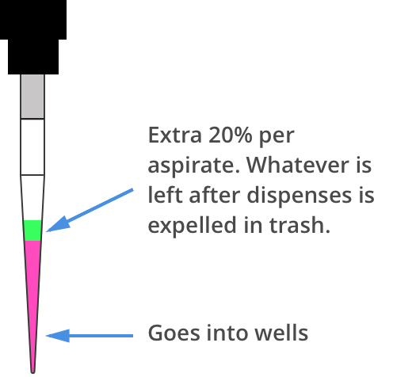

# Shared Parameters

All of the complex commands share a similar set of options and 
follow the same order of operations. To see a quick overview of the 
possible configuration options, jump down to the table below.

If you want to customize the behavior 
of the Complex Commands beyond what's shown on this page, we recommend
creating your own functions from the [Building Block Commands](../new_atomic_commands.md)

## Order of Operations In Complex Commands

Parameters to complex commands add behaviors to the generated complex
command in a specific order which can't be changed. Specifically,
advanced commands execute their atomic commands in this order:

1.  Tip logic
2.  Mix at source location
3.  Aspirate + Any disposal volume
4.  Touch tip
5.  Air gap
6.  Dispense
7.  Touch tip

Steps 1–7 are repeated for all wells, and then finally:

8.  Empty disposal volume into trash, if any
9.  Blow Out

Notice how blow out only occurs after getting rid of disposal volume. If
you want blow out to occur after every dispense, you shouldn't include a
disposal volume.

## Default Parameters

Parameters for the complex liquid handling are listed here in order of
operation. See below for an explanation of each of these parameters.

| Parameter(s) | Options | Transfer Defaults | Distribute Defaults | Consolidate Defaults |
| ---------- | ------------------ | ------- | ---------- | ---------- |
| `new_tip` | `'always'`, `'never'`, `'once'` | `'once'` | `'once'` | `'once'` |
| `mix_before`, `mix_after` | `mix_before` and `mix_after` require a tuple of (repetitions, volume) | No mixing either before aspirate or after dispense | No mixing before aspirate, mixing after dispense is ignored | Mixing before aspirate is ignored, no mix after dispense by default |
| `touch_tip` | `True` or `False`, if true touch tip on both source and destination wells | No touch tip by default | No touch tip by default | No touch tip by default |
| `air_gap` | Volume in µL | 0 | 0 | 0 |
| `blow_out` | `True` or `False`, if true blow out at dispense | `False` | `False` | `False` |
| `trash` |`True` or `False`, if false return tip to tiprack | `True` | `True` | `True` |
| `carryover` | `True` or `False`, if true split volumes that exceed max volume of pipette into smaller quantities | `True` | `False` | `False` |
| `disposal_volume` | Extra volume in µL to hold in tip while dispensing; better accuracies in multi-dispense | 0 | 10% of pipette max volume | 0 |


## Complex Liquid Handling Options

Below are some examples of the parameters described in the
table above.

### `new_tip`

This parameter handles tip logic. You have options of the strings
`'always'`, `'once'` and `'never'`. The default for every complex
command is `'once'`.

If you want to avoid cross-contamination and increase accuracy, you
should set this parameter to `'always'`.

_New in version 2.0_

#### Always Get a New Tip

Transfer commands will by default use the same tip for each well, then
finally drop it in the trash once finished.

The pipette can optionally get a new tip at the beginning of each
aspirate, to help avoid cross contamination.

```python
pipette.transfer(
    100,
    [plate.wells_by_name()[well_name] for well_name in ['A1', 'A2', 'A3']],
    [plate.wells_by_name()[well_name] for well_name in ['B1', 'B2', 'B3']],
    new_tip='always')    # always pick up a new tip
```

will have the steps...

```
Transferring 100 from wells A1...A3 in "1" to wells B1...B3 in "1"
Picking up tip well A1 in "2"
Aspirating 100.0 uL from well A1 in "1" at 1 speed
Dispensing 100.0 uL into well B1 in "1"
Dropping tip well A1 in "12"
Picking up tip well B1 in "2"
Aspirating 100.0 uL from well A2 in "1" at 1 speed
Dispensing 100.0 uL into well B2 in "1"
Dropping tip well A1 in "12"
Picking up tip well C1 in "2"
Aspirating 100.0 uL from well A3 in "1" at 1 speed
Dispensing 100.0 uL into well B3 in "1"
Dropping tip well A1 in "12"
```

#### Never Get a New Tip

For scenarios where you instead are calling `pick_up_tip()` and
`drop_tip()` elsewhere in your protocol, the transfer command can ignore
picking up or dropping tips.

```python
pipette.pick_up_tip()
# ...
pipette.transfer(
    100,
    [plate.wells_by_name()[well_name] for well_name in ['A1', 'A2', 'A3']],
    [plate.wells_by_name()[well_name] for well_name in ['B1', 'B2', 'B3']],
    new_tip='never')    # never pick up or drop a tip
# ...
pipette.drop_tip()
```

will have the steps...

```
Picking up tip well A1 in "2"
...
Transferring 100 from wells A1...A3 in "1" to wells B1...B3 in "1"
Aspirating 100.0 uL from well A1 in "1" at 1 speed
Dispensing 100.0 uL into well B1 in "1"
Aspirating 100.0 uL from well A2 in "1" at 1 speed
Dispensing 100.0 uL into well B2 in "1"
Aspirating 100.0 uL from well A3 in "1" at 1 speed
Dispensing 100.0 uL into well B3 in "1"
...
Dropping tip well A1 in "12"
```

#### Use One Tip

The default behavior of complex commands is to use one tip:

```python
pipette.transfer(
    100,
    [plate.wells_by_name()[well_name] for well_name in ['A1', 'A2', 'A3']],
    [plate.wells_by_name()[well_name] for well_name in ['B1', 'B2', 'B3']],
    new_tip='once')    # use one tip (default behavior)
```

will have the steps...

```
Picking up tip well A1 in "2"
Transferring 100 from wells A1...A3 in "1" to wells B1...B3 in "1"
Aspirating 100.0 uL from well A1 in "1" at 1 speed
Dispensing 100.0 uL into well B1 in "1"
Aspirating 100.0 uL from well A2 in "1" at 1 speed
Dispensing 100.0 uL into well B2 in "1"
Aspirating 100.0 uL from well A3 in "1" at 1 speed
Dispensing 100.0 uL into well B3 in "1"
Dropping tip well A1 in "12"
```

### `trash`

By default, complex commands will drop the pipette's tips in the trash
container. However, if you wish to instead return the tip to its tip
rack, you can set `trash=False`.

```python
pipette.transfer(
    100,
    plate['A1'],
    plate['B1'],
    trash=False)       # do not trash tip
```

will have the steps...

```
Transferring 100 from well A1 in "1" to well B1 in "1"
Picking up tip well A1 in "2"
Aspirating 100.0 uL from well A1 in "1" at 1 speed
Dispensing 100.0 uL into well B1 in "1"
Returning tip
Dropping tip well A1 in "2"
```

_New in version 2.0_

### `touch_tip`

A `touch-tip` can be performed after every
aspirate and dispense by setting `touch_tip=True`.

```python
pipette.transfer(
    100,
    plate['A1'],
    plate['A2'],
    touch_tip=True)     # touch tip to each well's edge
```

will have the steps...

```
Transferring 100 from well A1 in "1" to well A2 in "1"
Picking up tip well A1 in "2"
Aspirating 100.0 uL from well A1 in "1" at 1 speed
Touching tip
Dispensing 100.0 uL into well A2 in "1"
Touching tip
Dropping tip well A1 in "12"
```

_New in version 2.0_

### `blow_out`

A `blow-out` can be performed after every
dispense that leaves the tip empty by setting `blow_out=True`.

```python
pipette.transfer(
    100,
    plate['A1'],
    plate['A2'],
    blow_out=True)      # blow out droplets when tip is empty
```

will have the steps...

```
Transferring 100 from well A1 in "1" to well A2 in "1"
Picking up tip well A1 in "2"
Aspirating 100.0 uL from well A1 in "1" at 1 speed
Dispensing 100.0 uL into well A2 in "1"
Blowing out
Dropping tip well A1 in "12"
```

_New in version 2.0_

### `mix_before`, `mix_after`

A `mix` can be performed before every
aspirate by setting `mix_before=`, and after every dispense by setting
`mix_after=`. The value of `mix_before=` or `mix_after=` must be a
tuple; the first value is the number of repetitions, the second value is
the amount of liquid to mix.

```python
pipette.transfer(
    100,
    plate['A1'],
    plate['A2'],
    mix_before=(2, 50), # mix 2 times with 50uL before aspirating
    mix_after=(3, 75))  # mix 3 times with 75uL after dispensing
```

will have the steps...

```
Transferring 100 from well A1 in "1" to well A2 in "1"
Picking up tip well A1 in "2"
Mixing 2 times with a volume of 50ul
Aspirating 50 uL from well A1 in "1" at 1.0 speed
Dispensing 50 uL into well A1 in "1"
Aspirating 50 uL from well A1 in "1" at 1.0 speed
Dispensing 50 uL into well A1 in "1"
Aspirating 100.0 uL from well A1 in "1" at 1 speed
Dispensing 100.0 uL into well A2 in "1"
Mixing 3 times with a volume of 75ul
Aspirating 75 uL from well A2 in "1" at 1.0 speed
Dispensing 75.0 uL into well A2 in "1"
Aspirating 75 uL from well A2 in "1" at 1.0 speed
Dispensing 75.0 uL into well A2 in "1"
Aspirating 75 uL from well A2 in "1" at 1.0 speed
Dispensing 75.0 uL into well A2 in "1"
Dropping tip well A1 in "12"
```

_New in version 2.0_

### `air_gap`

An `air-gap` can be performed after every
aspirate by setting `air_gap=volume`, where the value is the volume of
air in µL to aspirate after aspirating the liquid. The entire volume in
the tip, air gap and the liquid volume, will be dispensed all at once at
the destination specified in the complex command.

```python
pipette.transfer(
    100,
    plate['A1'],
    plate['A2'],
    air_gap=20)         # add 20uL of air after each aspirate
```

will have the steps...

```
Transferring 100 from well A1 in "1" to well A2 in "1"
Picking up tip well A1 in "2"
Aspirating 100.0 uL from well A1 in "1" at 1.0 speed
Air gap
Aspirating 20 uL from well A1 in "1" at 1.0 speed
Dispensing 120.0 uL into well A2 in "1"
Dropping tip well A1 in "12"
```

_New in version 2.0_

### `disposal_volume`

When dispensing multiple times from the same tip in
`distribute()`, it's
recommended to aspirate an extra amount of liquid to be disposed of
after distributing. This added `disposal_volume` can be set as an
optional argument.

The default disposal volume is the pipette's minimum volume (see
[Defaults](../pipettes/defaults.md)), which will be blown out at
the trash after the dispenses.

```python
pipette.distribute(
    30,
    [plate.wells_by_name()[well_name] for well_name in ['A1', 'A2']],
    plate.columns_by_name()['2'],
    disposal_volume=60)   # include extra liquid to make dispenses more accurate, 20% of total volume
```

will have the steps...

```
Distributing 30 from wells A1...A2 in "1" to wells A2...H2 in "1"
Transferring 30 from wells A1...A2 in "1" to wells A2...H2 in "1"
Picking up tip well A1 in "2"
Aspirating 130.0 uL from well A1 in "1" at 1 speed
Dispensing 30.0 uL into well A2 in "1"
Dispensing 30.0 uL into well B2 in "1"
Dispensing 30.0 uL into well C2 in "1"
Dispensing 30.0 uL into well D2 in "1"
Blowing out at well A1 in "12"
Aspirating 130.0 uL from well A2 in "1" at 1 speed
Dispensing 30.0 uL into well E2 in "1"
Dispensing 30.0 uL into well F2 in "1"
Dispensing 30.0 uL into well G2 in "1"
Dispensing 30.0 uL into well H2 in "1"
Blowing out at well A1 in "12"
Dropping tip well A1 in "12"
```

See this image for example,

{.align-center}

_New in version 2.0_
