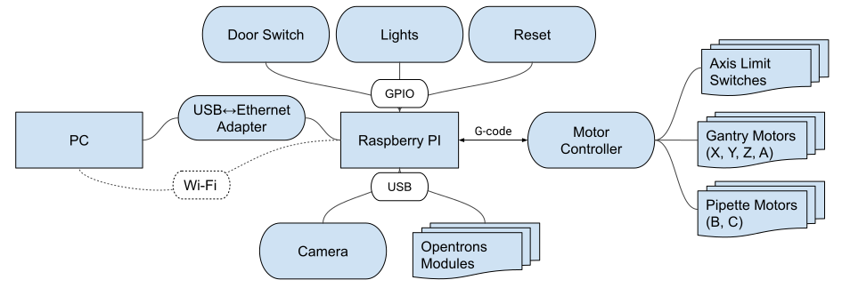
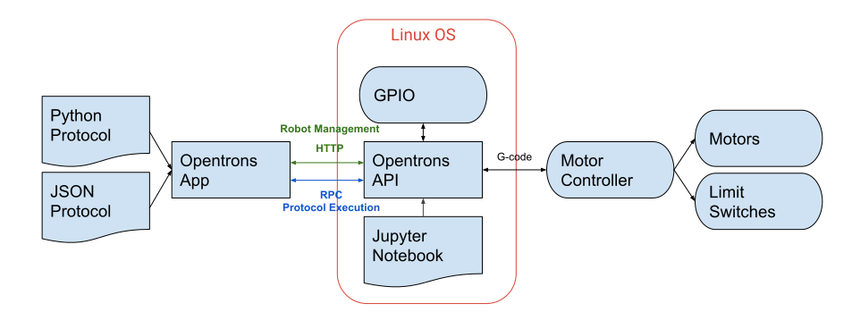

# Understanding the OT-2 Architecture

Fundamentally, OT-2 is just a computer that runs Linux that happens to be 
connected to some hardware, and has a Python module for controlling that 
hardware already installed. Because of that, it's very hackable and extensible 
to fit your needs.

At a (very) high level the OT-2 system is comprised of:

- 6 axes of motion under open-loop control
- A motor controller system is based on the Smoothieware project with a customized Smoothieboard controlling the motors
- The motor controller is driven by the Opentrons API which is housed on a Raspberry Pi 3 Model B running a minimal Linux-based operating system
- The Opentrons App is (optionally) used to control the OT-2 from a PC

## Hardware Architecture Overview

### Raspberry Pi

Inside the OT-2 is a small computer (a [Raspberry Pi 3 Model B](https://www.raspberrypi.org/products/raspberry-pi-3-model-b/)), running Linux.

Data is stored on the Raspberry Pi's SD card. The majority of the filesystem is read-only but certain directories such as `/data/` and `/var/` allow read-write access. The OT-2 camera (a webcam) is connected to a USB port on the Raspberry Pi (this port, and a 4th port which may have a flash drive that's no longer used, are normally covered by the Pi's case).

#### Networking

Your computer communicates with the Raspberry Pi inside the OT-2 via a network connection.

When you connect to your robot via USB, you're actually connecting to the Raspberry Pi's Ethernet port. The USB socket on the side of the robot leads to an internal USB-to-Ethernet adapter, which in turn leads to the Pi's Ethernet port.

When you connect your computer to the robot's USB port, your computer recognizes the device as a new network interface, and establishes a [link-local](https://en.wikipedia.org/wiki/Link-local_address) connection to the OT-2.

(You can also connect the OT-2 to a Wi-Fi network.)

### Lights, switches

The Raspberry Pi controls the lights of the robot, and detects presses on the switch and opening of the door via its General Purpose Input-Output (GPIO) ports. The GPIO ports also allow the Raspberry Pi to reset the motor controller board (described below).

### Motor control

The robot has 6 axes of motion, each controlled by a stepper motor:

- X: left/right
- Y: forward/back
- Z: left pipette up/down
- A: right pipette up/down
- B: left pipette plunger
- C: right pipette plunger

The motors, endstops, and probing switches are connected to the motor controller board, housed in the gantry. The motor controller board is a modified [Smoothieboard](http://smoothieware.org/smoothieboard) running [a custom fork of Smoothieware](https://github.com/Opentrons/SmoothiewareOT).

The motor controller board is connected to the Raspberry Pi via a UART connection, with the Pi sending commands in [G-code](https://en.wikipedia.org/wiki/G-code).

## Software Architecture Overview

The main operating system of the robot is a minimal version of Linux built using [a custom fork of buildroot](https://github.com/Opentrons/buildroot).

The buildroot [configuration](https://github.com/Opentrons/buildroot/blob/opentrons-develop/configs/ot2_defconfig) includes a number of standard packages, and also some specific to the OT2. Those specific to the OT2 are: the API, the robot server, the 'shared data', and the update server.

### API

The [Opentrons API](https://github.com/Opentrons/opentrons/tree/edge/api) is a Python package that provides an interface to control the OT-2. Protocols are written in the protocol API, which is a part of the API package.

With the API alone, a Python script or Jupyter notebook running on the OT2 is able to control the robot to perform liquid-handling operations.

### Robot server

The main such Python programme is the [robot server](https://github.com/Opentrons/opentrons/tree/edge/robot-server), which provides the interface to the robot that the Opentrons app on a user's computer can access to do routine robot work. It provides endpoints that allow performing calibration and running protocols uploaded from the app.

Note that only one process can have access to the robot's GPIO ports at a time. By default the robot server connects to these ports on start-up, which prevents a copy of the API running in Jupyter or imported from a Python script from using GPIO functionality. To gain access to the GPIOs in these custom scripts, one can disable the robot server with `systemctl stop opentrons-robot-server`, before importing the Opentrons API into the other Python script. However this will prevent the Opentrons app from connecting to the robot until the robot server is restarted with `systemctl start opentrons-robot-server`, or the robot is rebooted.

### Shared data

Some data needs to be shared between different parts of the Opentrons codebase. For example, the descriptions of how labware is shaped are needed by both Protocol Designer and the robot itself.

We keep data like this in the special [shared-data](https://github.com/Opentrons/opentrons/tree/edge/shared-data) directory, so all those different parts can easily include it.

## Update server

The [update server](https://github.com/Opentrons/opentrons/tree/edge/update-server) is a separate server designed primarily to allow updating the robot's software with a new system image built using buildroot. The update server also controls some system-specific tasks such as handling SSH keys and setting the robot's name.