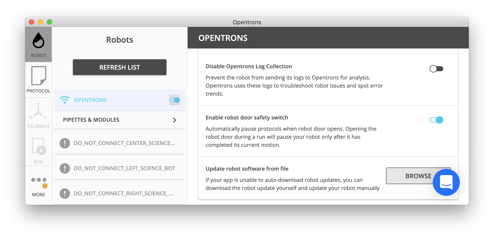

Building Block Commands
=======================

Building block, or basic, commands are the smallest individual actions
that can be completed on an OT-2. For example, the complex command
`transfer` (see [Complex Commands](new_complex_commands.md))
executes a series of `pick_up_tip()`, `aspirate()`, `dispense()` and
`drop_tip()` basic commands.

The examples in this section would be added to the following:

``` python
from opentrons import protocol_api

metadata = {'apiLevel': '{! apilevel.txt !}'}

def run(protocol: protocol_apiProtocolContext):
    tiprack = protocol.load_labware('corning_96_wellplate_360ul_flat', 2)
    plate = protocol.load_labware('opentrons_96_tiprack_300ul', 3)
    pipette = protocol.load_instrument('p300_single_gen2', mount='left')
    # the example code below would go here, inside the run function
```

This loads a [Corning 96 Well
Plate](https://labware.opentrons.com/corning_96_wellplate_360ul_flat) in
slot 2 and a [Opentrons 300 µL
Tiprack](https://labware.opentrons.com/opentrons_96_tiprack_300ul) in
slot 3, and uses a P300 Single GEN2 pipette.

Tip Handling
------------

When the OT-2 handle liquids with, it constantly exchanges old, used
tips for new ones to prevent cross-contamination between wells. Tip
handling uses the functions
`InstrumentContext.pick_up_tip()`,
`InstrumentContext.drop_tip()`, and
`InstrumentContext.return_tip()`.

### Pick Up Tip

Before any liquid handling can be done, your pipette must have a tip on
it. The command `InstrumentContext.pick_up_tip()` will move the pipette over to the specified tip, then press
down into it to create a vacuum seal. The below example picks up the tip
at location `'A1'` of the tiprack previously loaded in slot 3.

``` python
pipette.pick_up_tip(tiprack['A1'])
```

If you have associated a tiprack with your pipette such as in the
[Pipettes](new_pipette.md) or
[Protocols and Instruments](new_protocol_api.md)
sections, then you can simply call

``` python
pipette.pick_up_tip()
```

This will use the next available tip from the list of tipracks passed in
to the `tip_racks` argument of
`ProtocolContext.load_instrument()`.

_New in version 2.0_

### Drop Tip

Once finished with a tip, the pipette will remove the tip when we call
`InstrumentContext.drop_tip()`. You can
specify where to drop the tip by passing in a location. The below
example drops the tip back at its original location on the tip rack. If
no location is specified, the OT-2 will drop the tip in the fixed trash
in slot 12 of the deck.

```python
pipette.pick_up_tip()
pipette.drop_tip(tiprack['A1'])  # drop back in A1 of the tiprack
pipette.pick_up_tip()
pipette.drop_tip()  # drop in the fixed trash on the deck
```

_New in version 2.0_

### Return Tip

To return the tip to the original location, you can call
`InstrumentContext.return_tip()`. The
example below will automatically return the tip to `'A3'` on the tip
rack.

```python
pipette.pick_up_tip(tiprack['A3'])
pipette.return_tip()
```

=== "In API version 2.2 or above"

    ```python
    tip_rack = protocol.load_labware(
            'opentrons_96_tiprack_300ul', 1)
    pipette = protocol.load_instrument(
        'p300_single_gen2', mount='left', tip_racks=[tip_rack])

    pipette.pick_up_tip() # picks up tip_rack:A1
    pipette.return_tip()
    pipette.pick_up_tip() # picks up tip_rack:B1
    ```

=== "In API versions 2.0 and 2.1"

    ```python
    tip_rack = protocol.load_labware(
            'opentrons_96_tiprack_300ul', 1)
    pipette = protocol.load_instrument(
        'p300_single_gen2', mount='left', tip_racks=[tip_rack])

    pipette.pick_up_tip() # picks up tip_rack:A1
    pipette.return_tip()
    pipette.pick_up_tip() # picks up tip_rack:A1
    ```

#### Iterating Through Tips

For this section, instead of using the protocol defined above, consider
this setup:

```python
from opentrons import protocol_api

metadata = {'apiLevel': '{! apilevel.txt !}'}

def run(protocol: protocol_apiProtocolContext):
    plate = protocol.load_labware(
        'corning_96_wellplate_360ul_flat', 2)
    tip_rack_1 = protocol.load_labware(
        'opentrons_96_tiprack_300ul', 3)
    tip_rack_2 = protocol.load_labware(
        'opentrons_96_tiprack_300ul', 4)
    pipette = protocol.load_instrument(
        'p300_single_gen2', mount='left', tip_racks=[tip_rack_1, tip_rack_2])
```

This loads a [Corning 96 Well
Plate](https://labware.opentrons.com/corning_96_wellplate_360ul_flat) in
slot 2 and two [Opentrons 300ul
Tiprack](https://labware.opentrons.com/opentrons_96_tiprack_300ul) in
slots 3 and 4 respectively, and uses a P300 Single GEN2 pipette.

When a list of tip racks is associated with a pipette in its `tip_racks`
argument, the pipette will automatically pick up the next unused tip in
the list whenever you call
`InstrumentContext.pick_up_tip()`. The
pipette will first use all tips in the first tiprack, then move on to
the second, and so on:

```python
pipette.pick_up_tip()  # picks up tip_rack_1:A1
pipette.return_tip()
pipette.pick_up_tip()  # picks up tip_rack_1:A2
pipette.drop_tip()     # automatically drops in trash

# use loop to pick up tips tip_rack_1:A3 through tip_rack_2:H12
tips_left = 94 + 96 # add up the number of tips leftover in both tipracks
for _ in range(tips_left):
    pipette.pick_up_tip()
    pipette.return_tip()
```

If you try to `InstrumentContext.pick_up_tip()` again when all the tips have been used, the Protocol API
will show you an error:

```python
# this will raise an exception if run after the previous code block
pipette.pick_up_tip()
```

To change the location of the first tip used by the pipette, you can use
`InstrumentContext.starting_tip`:

```python
pipette.starting_tip = tip_rack_1.well('C3')
pipette.pick_up_tip()  # pick up C3 from "tip_rack_1"
pipette.return_tip()
```

To reset the tip tracking, you can call
`InstrumentContext.reset_tipracks()`:

```python
# Use up all tips
for _ in range(96+96):
     pipette.pick_up_tip()
     pipette.return_tip()

# Reset the tip tracker
pipette.reset_tipracks()

# Picks up a tip from well A1 of the first tip rack
pipette.pick_up_tip()
```

_New in version 2.0_

------------------------------------------------------------------------

Liquid Control
--------------

This section describes the `InstrumentContext`'s liquid-handling commands.

The examples in this section should be inserted in the following:

```python
metadata = {'apiLevel': '{! apilevel.txt !}'}

def run(protocol):
    tiprack = protocol.load_labware('corning_96_wellplate_360ul_flat', 2)
    plate = protocol.load_labware('opentrons_96_tiprack_300ul', 3)
    pipette = protocol.load_instrument('p300_single_gen2', mount='left', tip_racks=[tiprack])
    pipette.pick_up_tip()
    # example code goes here
```

This loads a [Corning 96 Well
Plate](https://labware.opentrons.com/corning_96_wellplate_360ul_flat) in
slot 2 and a [Opentrons 300ul
Tiprack](https://labware.opentrons.com/opentrons_96_tiprack_300ul) in
slot 3, and uses a P300 Single GEN2 pipette.

### Aspirate

To aspirate is to pull liquid up into the pipette's tip. When calling
`InstrumentContext.aspirate()` on a
pipette, you can specify the volume to aspirate in µL, where to aspirate
from, and how fast to aspirate liquid.

```python
pipette.aspirate(50, plate['A1'], rate=2.0)  # aspirate 50uL from plate:A1
```

Now the pipette's tip is holding 50 µL.

The `location` parameter is either a well (like `plate['A1']`) or a
position within a well, like the return value of `plate['A1'].bottom`.

The `rate` parameter is a multiplication factor of the pipette's
default aspiration flow rate. The default aspiration flow rate for all
pipettes is in the `defaults`{.interpreted-text role="ref"} section.

You can also simply specify the volume to aspirate, and not mention a
location. The pipette will aspirate from its current location (which we
previously set as `plate['A1'])`.

```python
pipette.aspirate(50)                     # aspirate 50uL from current position
```

Now our pipette's tip is holding 100 µL.

!!! Note
    In version 1 of this API, `aspirate()` (and `dispense()`) would inspect the
    types of the `volume` and `location` arguments and do the right thing if
    you specified only a location or specified location and volume out of
    order. In this and future versions of the Python Protocol API, this is
    no longer true. Like any other Python function, if you are specifying
    arguments by position without using their names, you must always specify
    them in order.

!!! Note
    By default, the OT-2 will move to 1mm above the bottom of the target
    well before aspirating. You can change this by using a well position
    function like `Well.bottom()` (see
    [Specifying Position Within Wells](new_labware.md#specifying-position-within-wells) every time you
    call `aspirate`, or - if you want to change the default throughout your
    protocol - you can change the default offset with
    `.InstrumentContext.well_bottom_clearance`{.interpreted-text
    role="obj"} (see [Default Positions Within Wells](new_labware.md#default-positions-within-wells)). 


_New in version 2.0_

### Dispense

To dispense is to push out liquid from the pipette's tip. The usage of
`InstrumentContext.dispense()` in the
Protocol API is similar to
`InstrumentContext.aspirate()`, in that
you can specify volume in µL and location, or only volume.

```python
pipette.dispense(50, plate['B1'], rate=2.0) # dispense 50uL to plate:B1 at twice the normal rate
pipette.dispense(50)              # dispense 50uL to current position at the normal rate
```

The `location` parameter is either a well (like `plate['A1']`) or a
position within a well, like the return value of `plate['A1'].bottom`.

The `rate` parameter is a multiplication factor of the pipette's
default dispense flow rate. The default dispense flow rate for all
pipettes is in the [Defaults](new_pipette.md#defaults) section.

!!! Note
    By default, the OT-2 will move to 1mm above the bottom of the target
    well before dispensing. You can change this by using a well position
    function like `Well.bottom()` (see
    [Specifying Position Within Wells](new_labware.md#specifying-position-within-wells)) every time you
    call `dispense()`, or - if you want to change the default throughout your
    protocol - you can change the default offset with
    `.InstrumentContext.well_bottom_clearance`{.interpreted-text
    role="obj"} (see [Default Positions Within Wells](new_labware.md#default-positions-within-wells)).


!!! Note
    In version 1 of this API, `dispense()` (and `aspirate()`) would inspect the
    types of the `volume` and `location` arguments and do the right thing if
    you specified only a location or specified location and volume out of
    order. In this and future versions of the Python Protocol API, this is
    no longer true. Like any other Python function, if you are specifying
    arguments by position without using their names, you must always specify
    them in order.

_New in version 2.0_

### Blow Out

To blow out is to push an extra amount of air through the pipette's
tip, to make sure that any remaining droplets are expelled.

When calling `InstrumentContext.blow_out()`, you can specify a location to blow out the remaining
liquid. If no location is specified, the pipette will blow out from its
current position.

```python
pipette.blow_out()            # blow out in current location
pipette.blow_out(plate['B3']) # blow out in current plate:B3
```

_New in version 2.0_

### Touch Tip

To touch tip is to move the pipette's currently attached tip to four
opposite edges of a well, to knock off any droplets that might be
hanging from the tip.

When calling `InstrumentContext.touch_tip()` on a pipette, you have the option to specify a location
where the tip will touch the inner walls.

`touch_tip()` can
take up to 4 arguments: `touch_tip(location, radius, v_offset, speed)`.

```python
pipette.touch_tip()            # touch tip within current location
pipette.touch_tip(v_offset=-2) # touch tip 2mm below the top of the current location
pipette.touch_tip(plate['B1']) # touch tip within plate:B1
pipette.touch_tip(plate['B1'], speed=100) # touch tip within plate:B1 at 100 mm/s
pipette.touch_tip(plate['B1'], # touch tip in plate:B1, at 75% of total radius and -2mm from top of well
                  radius=0.75,
                  v_offset=-2)
```

_New in version 2.0_

### Mix

To mix is to perform a series of `aspirate()` and `dispense()` commands in a
row on a single location. Instead of having to write those commands out
every time, you can call `InstrumentContext.mix()`.

The `mix` command takes up to three arguments:
`mix(repetitions, volume, location)`:

```python
# mix 4 times, 100uL, in plate:A2
pipette.mix(4, 100, plate.['A2'])
# mix 3 times, 50uL, in current location
pipette.mix(3, 50)
# mix 2 times, pipette's max volume, in current location
pipette.mix(2)
```

!!! Note
    In API Versions 2.2 and earlier, mixes consist of aspirates and then
    immediate dispenses. In between these actions, the pipette moves up and
    out of the target well. In API Version 2.3 and later, the pipette will
    not move between actions.


_New in version 2.0_

### Air Gap

When dealing with certain liquids, you may need to aspirate air after
aspirating the liquid to prevent it from sliding out of the pipette's
tip. A call to `InstrumentContext.air_gap()` with a volume in µL will aspirate that much air into the
tip. `air_gap()` takes up to two arguments: `air_gap(volume, height)`:

```python
pipette.aspirate(100, plate['B4'])
pipette.air_gap(20)
pipette.drop_tip()
```

_New in version 2.0_

------------------------------------------------------------------------

Utility Commands
----------------

### Move To

You can use `InstrumentContext.move_to()` to move a pipette to any location on the deck.

For example, you can move to the first tip in your tip rack:

```python
pipette.move_to(tiprack['A1'].top())
```

Unlike commands that require labware, like
[Aspirate](#aspirate) or
[Dispense](#dispense),
`move_to()` deals
with `Location` instances,
which combine positions in [Deck Coordinates](new_protocol_api.md#deck-coordinates) and associated `Labware`
instances. You don't have to create them yourself; this is what is
returned from methods such as `Well.top()` and `Well.bottom()`. It
does mean, however, that you can't move to a well directly; you must
use `Well.top()` or build a
`Location` yourself.

You can also specify at what height you would like the robot to move to
inside of a location using `Well.top()`
and `Well.bottom()` methods on that
location (more on these methods and others like them in the
[Specifying Position Within Wells](new_labware.md#specifying-position-within-wells) section):

```python
pipette.move_to(plate['A1'].bottom())  # move to the bottom of well A1
pipette.move_to(plate['A1'].top())     # move to the top of well A1
pipette.move_to(plate['A1'].bottom(2)) # move to 2mm above the bottom of well A1
pipette.move_to(plate['A1'].top(-2))   # move to 2mm below the top of well A1
```

The above commands will cause the robot's head to first move upwards,
then over to above the target location, then finally downwards until the
target location is reached. If instead you would like the robot to move
in a straight line to the target location, you can set the movement
strategy to `'direct'`.

```python
pipette.move_to(plate['A1'].top(), force_direct=True)
```

!!! Warning
    Moving without an arc will run the risk of colliding with things on your
    deck. Be very careful when using this option.


Usually the above option is useful when moving inside of a well. Take a
look at the below sequence of movements, which first move the head to a
well, and use 'direct' movements inside that well, then finally move
on to a different well.

```python
pipette.move_to(plate['A1'].top())
pipette.move_to(plate['A1'].bottom(1), force_direct=True)
pipette.move_to(plate['A1'].top(-2), force_direct=True)
pipette.move_to(plate['A2'].top())
```

_New in version 2.0_

### Delay

Sometimes you need to pause your protocol, for instance to wait for
something to incubate. You can use
`ProtocolContext.delay()` to pause your
protocol for a specific amount of time. `delay` is a method of
`ProtocolContext` since it concerns
the protocol and the OT-2 as a whole.

The value passed into `delay()` is the number of minutes or seconds the
OT-2 will wait until moving on to the next command.

```python
protocol.delay(seconds=2)             # pause for 2 seconds
protocol.delay(minutes=5)             # pause for 5 minutes
protocol.delay(minutes=5, seconds=2)  # pause for 5 minutes and 2 seconds
```

### User-Specified Pause

The method `ProtocolContext.pause()`
will pause protocol execution at a specific step. You can resume by
pressing 'resume' in your Opentrons App. You can optionally specify a
message that will be displayed in the Opentrons App when protocol
execution pauses.

```python
from opentrons import protocol_api

metadata = {'apiLevel': '{! apilevel.txt !}'}

def run(protocol: protocol_apiProtocolContext):
    # The start of your protocol goes here...

    # The OT-2 stops here until you press resume. It will display the message in
    # the Opentrons App. You do not need to specify a message, but it makes things
    # more clear.
    protocol.pause('Time to take a break')
```

_New in version 2.0_

### Homing

You can manually request that the OT-2 home during protocol execution.
This is typically not necessary; however, if at any point you will
disengage motors or move the gantry with your hand, you may want to
command a home afterwards.

To home the entire OT-2, you can call
`ProtocolContext.home()`.

To home a specific pipette's Z axis and plunger, you can call
`InstrumentContext.home()`.

To home a specific pipette's plunger only, you can call
`InstrumentContext.home_plunger()`.

None of these functions take any arguments:

```python
from opentrons import protocol_api, types

metadata = {'apiLevel': '{! apilevel.txt !}'}

def run(protocol: protocol_apiProtocolContext):
    pipette = protocol.load_instrument('p300_single', 'right')
    protocol.home() # Homes the gantry, z axes, and plungers
    pipette.home()  # Homes the right z axis and plunger
    pipette.home_plunger() # Homes the right plunger
```

_New in version 2.0_

### Comment

The method `ProtocolContext.comment()`
lets you display messages in the Opentrons App during protocol
execution:

```python
from opentrons import protocol_api, types

metadata = {'apiLevel': '{! apilevel.txt !}'}

def run(protocol: protocol_apiProtocolContext):
    protocol.comment('Hello, world!')
```

_New in version 2.0_

### Control and Monitor Robot Rail Lights

You can turn the robot rail lights on or off in the protocol using
`ProtocolContext.set_rail_lights()`:

```python
from opentrons import protocol_api

metadata = {'apiLevel': '{! apilevel.txt !}'}

def run(protocol: protocol_apiProtocolContext):
    # turn on robot rail lights
    protocol.set_rail_lights(True)

    # turn off robot rail lights
    protocol.set_rail_lights(False)
```

_New in version 2.5_

You can also check whether the rail lights are on or off in the protocol
using `ProtocolContext.rail_lights_on`:

```python
protocol.rail_lights_on  # returns True when the lights are on,
                         # False when the lights are off
```

_New in version 2.5_


### Monitor Robot Door

The door safety switch feature flag has been added to the OT-2 software
since the 3.19.0 release. Enabling the feature flag allows your robot to
pause a running protocol and prohibit the protocol from running when the
robot door is open.



You can also check whether or not the robot door is closed at a specific
point in time in the protocol using
`ProtocolContext.door_closed`:

```python
protocol.door_closed  # return True when the door is closed,
                      # False when the door is open
```

!!! Note
    Both the top window and the front door must be closed in order for the
    robot to report the door is closed.


!!! Warning
    If you chose to enable the door safety switch feature flag, you should
    only use `ProtocolContext.door_closed`
    as a form of status check, and should not use it to control robot
    behavior. If you wish to implement custom method to pause or resume
    protocol using `ProtocolContext.door_closed`, make sure you have first disabled the feature flag.

_New in version 2.5_

