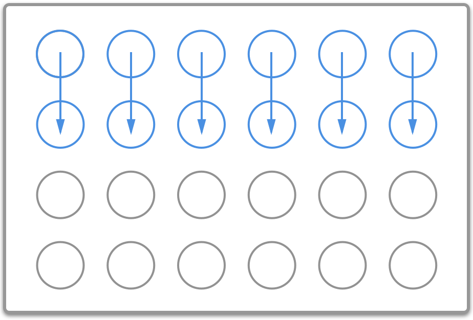
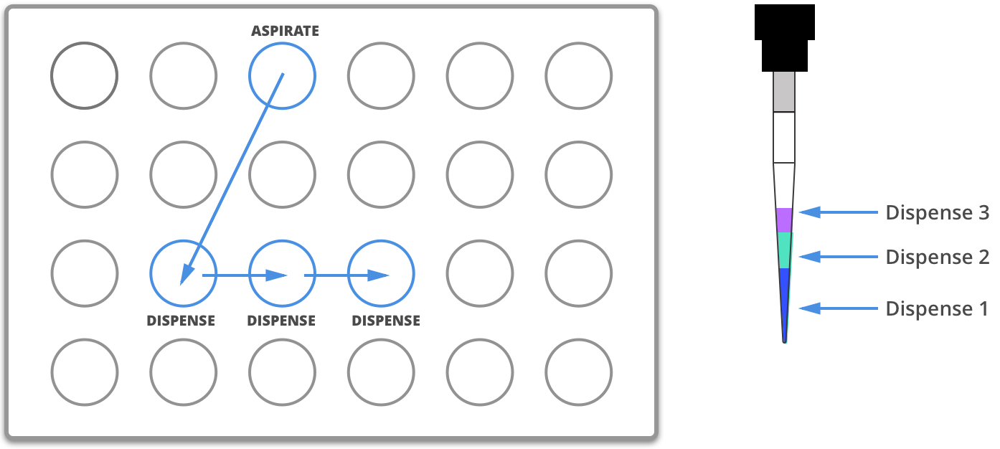
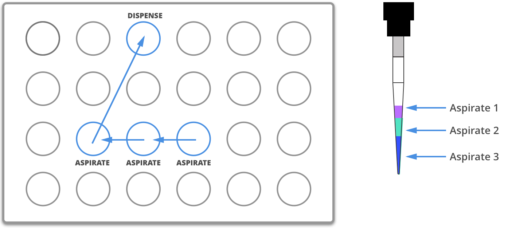

# Overview

The commands in this section execute long or complex series of the
commands described in the [Building Block Commands](new_atomic_commands.md) section. 
These advanced commands make it easier to handle larger groups of 
wells and repetitive actions.

The examples in this section will use the following set up:

```python
from opentrons import protocol_api

metadata = {'apiLevel': '{! version_info/apilevel.txt !}'}

def run(protocol: protocol_apiProtocolContext):
    plate = protocol.load_labware('corning_96_wellplate_360ul_flat', 1)
    tiprack = protocol.load_labware('opentrons_96_tiprack_300ul', 2)
    tiprack_multi = protocol.load_labware('opentrons_96_tiprack_300ul', 3)
    pipette = protocol.load_instrument('p300_single', mount='left', tip_racks=[tiprack])
    pipette_multi = protocol.load_instrument('p300_multi', mount='right', tip_racks=[tiprack_multi])

    # The code used in the rest of the examples goes here
```

This loads a [Corning 96 Well
Plate](https://labware.opentrons.com/corning_96_wellplate_360ul_flat) in
slot 1 and a [Opentrons 300 µL
Tiprack](https://labware.opentrons.com/opentrons_96_tiprack_300ul) in
slot 2 and 3, and uses a P300 Single pipette and a P300 Multi pipette.

You can follow along and simulate the protocol using our protocol
simulator, which can be installed by following the instructions at
[Simulating Your Scripts](simulating.md).

There are three complex liquid handling commands:

| Method  |  One source well to a group of destination wells | Many source wells to a group of destination wells | Many source wells to one destination well |
| --- | --- | --- | --- |
| `transfer()` | :material-check: Yes | :material-check: Yes | :material-check: Yes |
| `distribute()` | :material-check: Yes | :material-check: Yes | :material-close: No |
| `consolidate()` | :material-close: No | :material-check: Yes | :material-check: Yes |

You can also refer to these images for further clarification.

## Transfer Diagram



## Distribute Diagram



## Consolidate Diagram



------------------------------------------------------------------------


